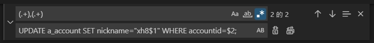

# Visual Studio Code 正規取代

```
test426,485372
demojy123,485373
easyfat99,485374
```

```
UPDATE a_account SET nickname="xh8test426" WHERE accountid=485372;
UPDATE a_account SET nickname="xh8demojy123" WHERE accountid=485373;
UPDATE a_account SET nickname="xh8easyfat99" WHERE accountid=485374;
```